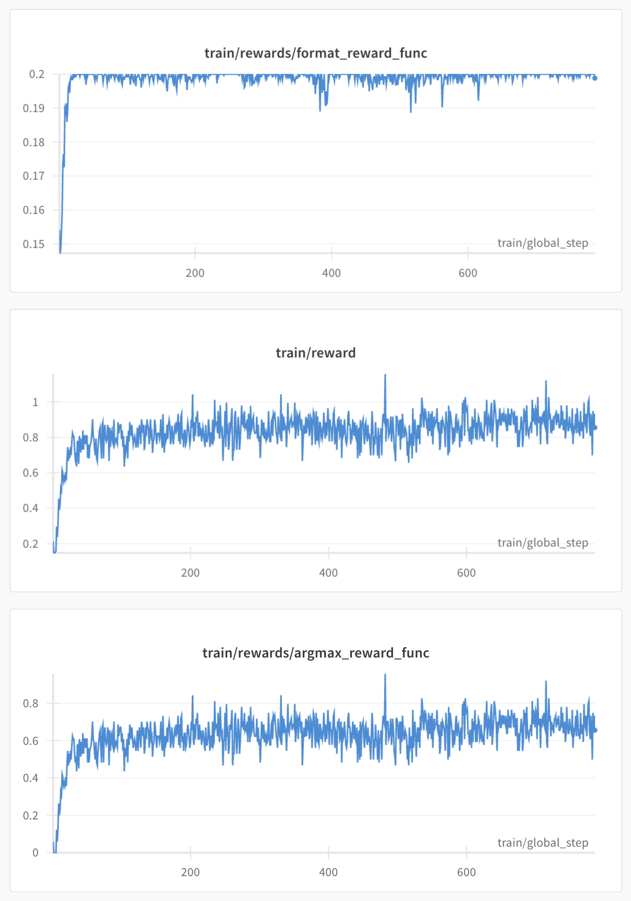

<p align="center">

</p>

# Tiny & Mighty Reward Models: `j1-micro` & `j1-nano`


`j1-micro` and `j1-nano` are tiny but mighty reward models finetuned from Qwen3 via a variant of **Self-Principled Critique Tuning**, introduced by DeepSeek in [*Inference-Time Scaling for Generalist Reward Modeling*](https://arxiv.org/abs/2504.02495). This is one particular approach to [scaling judge-time compute](https://github.com/haizelabs/verdict) that factors the reward modeling task into two steps:

1. Generate a set of query-specific principles (rubric) that can be used to evaluate a given sample
2. Based on these principles, generate rationales ("critiques") to produce a final pointwise numeric rating (reward)


Our `j1` models are trained exclusively on the Skywork v2.0 dataset for the pairwise preference modeling task. They perform outstandingly well on this task, matching or beating the performance of order-of-magnitude larger models, as measured by RewardBench (see [Results](#results)). This is achieved *purely* via RL, which rewards emergent instance-specific rubric creation.

`j1-micro` and `j1-nano` were each trained in <1 day on a single 80GB A100 GPU with LoRA. They are *only* 1.7B and 0.6B parameters, respectively.

## Results

We report performance on RewardBench, the gold standard for measuring reward models.

<div align="center">

| Model | RewardBench Score |
|-------|:-------------:|
| Qwen3-1.7B | 29.51% |
| Qwen3-1.7B (Soft Match) | 69.38% |
| Tulu-2-70b | 77.20% |
| Claude-3-Opus-20240229 | 80.10% |
| GPT-4o-mini-2024-07-18 | 80.10% |
| Llama-3-70B-Instruct | 77.00% |
| **j1-micro** | **80.70%** |

</div>

### Training Progress
<br>
<p align="center">

</p>


## Emergent Instance-Specific Rubric Creation

> [!IMPORTANT]  
> One critical upshot of Self-Principled Critique Tuning is that it induces Judge models to propose instance-specific rubrics. This enables more tailored, relevant scoring — unlike ostensibly one-size-fits-all evaluator models.

To illustrate this, consider the following example from RewardBench:

#### Input

```
You are given a paper citation, convert it to the requested citation style.

Chicago: Vaswani, Ashish, Shazeer, Noam, Parmar, Niki, Uszkoreit, Jakob, Jones, Llion, Gomez, Aidan N., Kaiser, Lukasz, and Illia Polosukhin. ""Attention Is All You Need."" arXiv, (2017). https://doi.org/10.48550/arXiv.1706.03762.
MLA:
```

#### Response A

```
Here is the citation converted to MLA style:

MLA: Vaswani, Ashish, et al. ""Attention Is All You Need."" *arXiv*, 2017, doi:10.48550/arXiv.1706.03762.

Please note that in MLA format, when there are more than three authors, the first author's name is listed followed by the term ""et al."" Also, italicization is used for the title of the source, and the date of publication is not enclosed in parentheses. The ""doi"" is included as a direct identifier for the work.
```

#### Response B

```
Vaswani, Ashish, Shazeer, Noam, Parmar, Niki, Uszkoreit, Jakob, Jones, Llion, Gomez, Aidan N., Kaiser, Lukasz, and Illia Polosukhin. "Attention Is All You Need." arXiv, (2017). https://doi.org/10.48550/arXiv.1706.03762.
```

#### Qwen3-1.7B Base Generates Generic Rubrics
The rubric and reasoning generated by base Qwen3-1.7B Judge is fairly banal and ultimately useless:

```
<specific_criteria>
Instruction Adherence (40%): Ensures the response strictly follows the instruction to convert the given citation to MLA style.
Usefulness (30%): Provides accurate and complete information regarding the citation conversion.
Level of Detail (20%): Includes all necessary details such as proper formatting and explanations.
Relevance (10%): Stays focused on the task of converting the citation to MLA style.
</specificriteria>
<analysis>
Response A adheres to the instruction by providing a correctly formatted MLA citation. It also includes additional useful information about MLA formatting rules, which enhances its usefulness and detail level. However, it slightly deviates from the relevance criterion by adding extra explanatory notes that were not specifically asked for.

Response B partially adheres to the instruction as it does not include the necessary explanatory notes and does not follow the MLA style guidelines accurately. It is less useful and detailed compared to Response A, and it is less relevant due to the lack of proper formatting.
</analysis>
<scores>
\boxed{8, 5}
</scores>
```

#### j1-micro Generates Instance-Specific Rubrics
```
<think>
Okay, let's tackle this evaluation. First, the instruction adherence. The user wants the citation converted to MLA style. Response A gives the correct answer but includes a note that's not necessary. Response B provides the citation but misses the ""et al."" in the first author's name. The original instruction might have required the answer without the note, so the assistant needs to check if the answer includes the note or not.

Then, the usefulness. Response A includes the note but the answer is correct. Response B gives the citation but the note is missing. The user might have expected the answer to be the converted citation without the explanation, but the initial instruction might have included the note as part of the answer. The answer needs to be evaluated based on whether the response includes the correct format and the note.

Relevance: The answer must be directly related to the citation conversion. The response must ensure that the answer is in the correct format, including the title in italics and the doi. The assistant should check if the answer includes all the necessary elements and if the formatting is correct.

Detail: The answer should have the correct number of authors, the title in italics, the date, and the doi. The response A includes the note but the answer is the correct citation. The response B includes the citation but the note is missing. The assistant must determine the detail in the answer based on the presence of all required elements.

Also, the weights for the criteria. The initial answer might have a higher score for the note, but the user's instruction might have required the answer without the note. The overall score would need to consider the adherence to the instruction, the correctness of the answer, and the presence of necessary elements.
</think>

<specific_criteria>
Additional criteria for the query:
1. Citation Formatting Accuracy: The response must strictly adhere to the MLA format, including title in italics, author names, and the correct placement of the ""et al."" in the first author's name.
2. Clarity of Instructions: The response must clearly state the conversion task and provide the answer in the required format without any ambiguity.
3. Consistency in Answering: The answer must not include any extra information or explanations that deviate from the instruction. The response must be a direct answer without unnecessary notes or comments.
4. Proper Use of DOIs: The answer must include the DOI in the correct format (e.g., ""https://doi.org/10.48550/arXiv.1706.03762"") and ensure that the citation is fully compliant with the MLA style.
5. Weighting: The criteria for instruction adherence (10 points) and answer clarity (7 points) should be emphasized, while the formatting accuracy (6 points) and detail (5 points) are critical for the final score.
</specific_criteria>
<analysis>
Response A fully adheres to the instruction, provides the correct MLA citation with a note that is included as per the user's original request. However, the note is not necessary for the answer and may be considered irrelevant to the main task. The answer includes the correct formatting (title in italics, authors listed, DOI included) but the note is an extra explanation that could be omitted. Response B provides the correct citation but fails to include the ""et al."" in the first author's name, which is a critical detail in MLA format. The answer is complete but lacks the note that was included in the original instruction. Both responses are highly relevant but differ in the inclusion of the note and the formatting of the authors' names.
</analysis>
<scores>
\boxed{7, 3}
</scores>
```

As you can tell, the generated criteria (see `<specific_criteria>` section) and critiques from `j1-micro` are far more relevant and tailored to the idiosyncrasies of the specific input & response pair vs. the rubric and critiques from Qwen3-1.7B.

More examples can be found in `results/`.

## Reproducing RewardBench Results

First, download the LoRA weights for [j1-nano](https://huggingface.co/haizelabs/j1-nano) and [j1-micro](https://huggingface.co/haizelabs/j1-micro).

Spin up a local vLLM server:

```bash
vllm serve Qwen/Qwen3-0.6B --enable-lora --lora-modules j1-nano=[path-to-snapshot]
```

```bash
vllm serve Qwen/Qwen3-1.7B --enable-lora --lora-modules j1-micro=[path-to-snapshot]
```

Finally, run the test script:

```bash
python test_j1.py --model-name {j1-nano, j1-micro}
```

Results will be saved to `results/j1_rewardbench.csv` by default.

## Citation
```bibtex
@misc{j1micro2025,
    title = {j1: Tiny Generalist Reward Models via Inference-Time Rubric Proposal},
    author = {Haize Labs},
    url = {https://github.com/haizelabs/j1-micro},
    month = {May},
    year = {2025}
}
```
